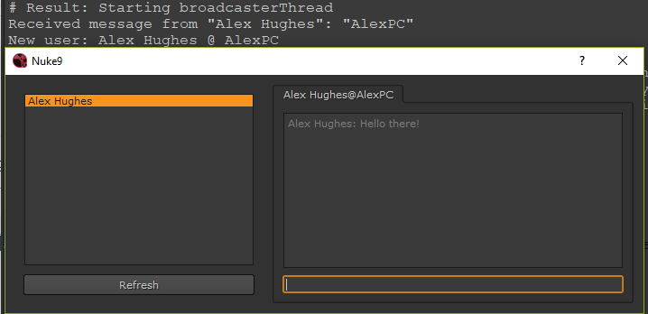

# ChitChat
P2P Instant Messaging app written in Python and Qt

# WARNING
### It is very very alpha right now. Many features don't yet work.

## Issues:
 - Windows broadcast packet sending seems different. I am hacking it locally and sending it to 127.0.0.1 instead of 255.255.255.255 but I am not sure why 255 doesn't work on windows.
 - Sending the message to another user hasn't been tested it. There were some heavy api changes in the networking layer so I assume that it probably won't work.

## Future Features:
 - Send parts of nukescripts/extra mimedata to the other person.
 - Emojis/gifs
 - Nicer UI
 - timestamped messages
 - Remote user's messages should be right justified.
 - Refresh should happen passively every 1min or so.
 - Refresh should remove uses that are no longer around.
 - Build it into a Qt panel for Nuke or Maya.